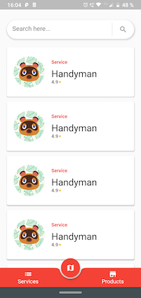
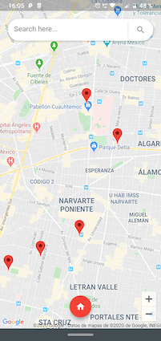
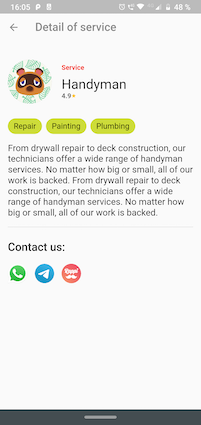
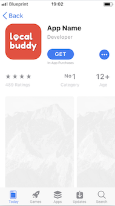

# local buddy

Application for Flutter hackathon.

local buddy is an app to find and share local services or products. The pandemic has force a lot of people to 
find an income out of things they can do while staying safe at home. So in this new phase for local 
businesses, we want to help by providing a new way to connect and discover your neighbourhood. 

**You would never imagine that you neighbors could do so many things!**

## The App

Inside the app local buddies would be able to upload products or services that they are offering, 
such as a cake from your neighbour who had a pastry shop but it is 
temporarily closed or an electrician living nearby who without a 
digital presence before signing up in the app.

The view for the local buddy searching for a product or services looks like this:

Here the local buddy can select if he is looking for products and services by clicking one of the 
options at the bottom of the screen. And search for a specific one with the search bar at the top.

There's also a map view! This view allows the local buddy to explore the neighbour's offerings.

When the local buddy clicks a marker (or a card on the list view) the details of that product or 
service are showed. With this, two local buddies are connected.
Neighbours support each other.

## [#Hack20](https://flutterhackathon.com)

[@sofiarivas](https://github.com/sofiarivas) [@rockar06](https://github.com/rockar06) and [@ricguti](https://github.com/ricguti) made this project for #Hack20 hackathon. We followed the theme
*Saving the Planet: Eco / What we've learned during 
the pandemic*. 

## Build the project

In order to build the project you need an API key. Please follow [Maps SDK for Android's Get API key](https://developers.google.com/maps/documentation/android-sdk/get-api-key) to get it.
Once you have it go to `android/local.properties` and add a property named `google.maps` with the 
value of your API key. Like this:

`google.maps=youApiKey`

After that: 
- Download the dependencies (`flutter pub get`)
- Connect your Android device (you can check it with `flutter devices`)
- Run the project (`flutter run`).